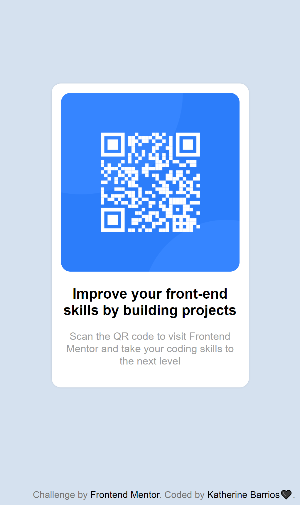

# Frontend Mentor - QR code component solution

This is a solution to the [QR code component challenge on Frontend Mentor](https://www.frontendmentor.io/challenges/qr-code-component-iux_sIO_H). Frontend Mentor challenges help you improve your coding skills by building realistic projects. 

## Table of contents

- [Overview](#overview)
  - [Screenshot](#screenshot)
  - [Links](#links)
- [My process](#my-process)
  - [Built with](#built-with)
  - [What I learned](#what-i-learned)
- [Author](#author)

## Overview

### Screenshot

### Links

- Solution URL: [Add solution URL here](https://kbarriosgit.github.io/qr-component/)
- Live Site URL: [Add live site URL here](https://kbarriosgit.github.io/qr-component/)

## My process

### Built with

- Semantic HTML5 markup
- CSS custom properties
- Flexbox
- CSS Grid

### What I learned

Aprendi a centrar un div, definiendo con height, align-items y display.

## Author

- Frontend Mentor - [@kbarriosgit](https://www.frontendmentor.io/profile/kbarriosgit)
- Twitter - [@katt_barrios](https://www.twitter.com/katt_barrios)
